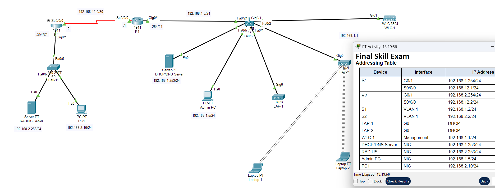
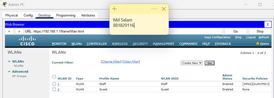

# Network Security Data Analysis & Packet Tracer Labs

This project combines Cisco Packet Tracer network design with security-focused data analysis.

## Overview

- Designed network topologies in Cisco Packet Tracer.
- Analysed network behaviour and security posture.
- Documented findings in a NetSec Data Analysis report.

## Files

- **Packet Tracer Topology (.pkt / .pka)** – Lab network designs.
- **NetSec Data Analysis Report (.docx/.pdf)** – Written analysis.
- **Screenshots** – Network topology and configuration views.

## Example Screenshots

## Skills Demonstrated

- Network design and visualisation  
- Basic routing and segmentation  
- Security analysis of small networks  

